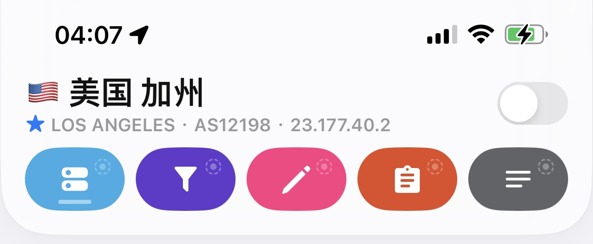
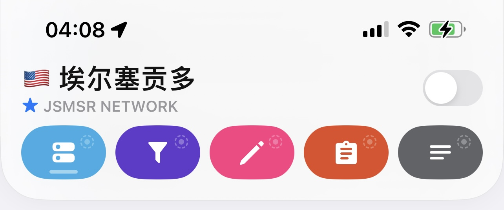
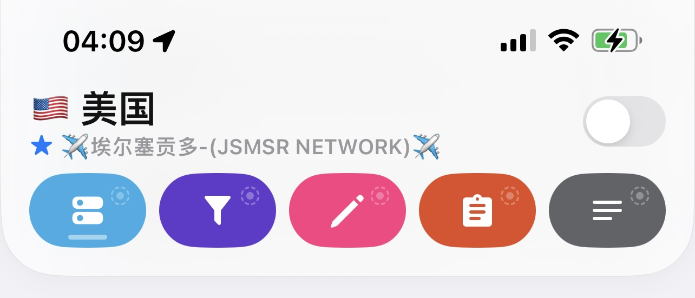
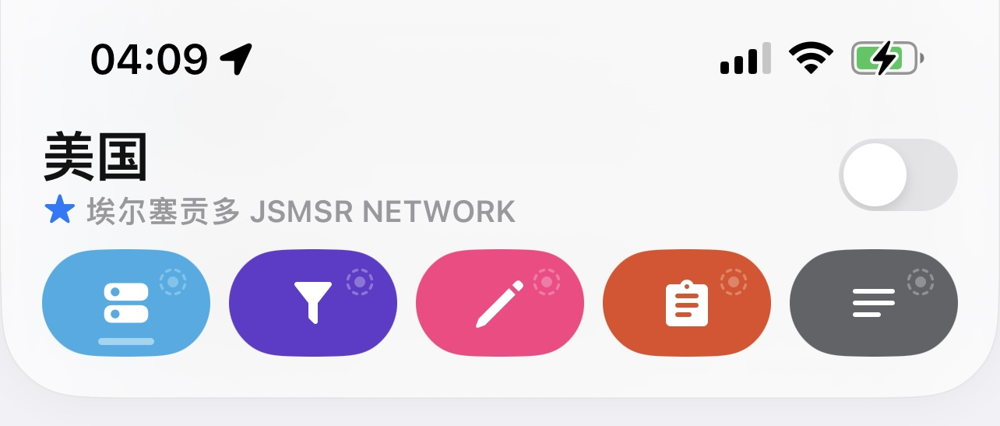
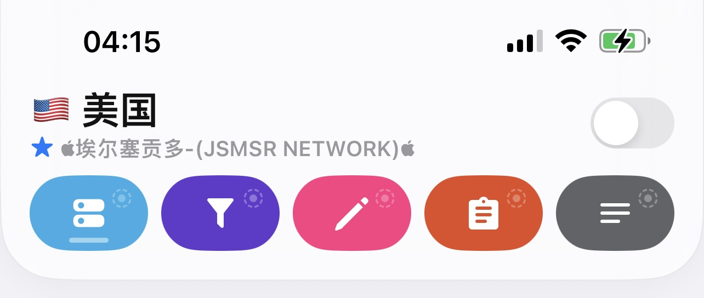
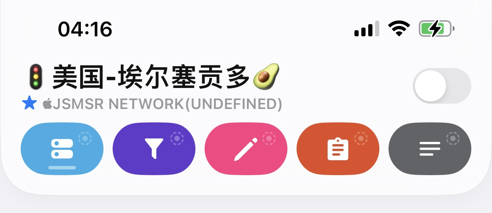

<h2 align="center">本地Geo检查器</h2>

<h4 align="center">支持QuantumultX、优化中文和英文</h4>


## 📦 使用教程

- 编辑配置，[general]下替换掉 <b>geo_location_checker=</b> 所在行代码


**IP-API-A**
```
geo_location_checker=http://ip-api.com/json/?lang=zh-CN, https://raw.githubusercontent.com/BOBOLAOSHIV587/Rules/main/QuantumultX/GeoLocationChecker/IP-API-A.js
```
 </div>


**IP-API-B**
```
geo_location_checker=http://ip-api.com/json/?lang=zh-CN, https://raw.githubusercontent.com/BOBOLAOSHIV587/Rules/main/QuantumultX/GeoLocationChecker/IP-API-B.js
```
 </div>


**IP-API-C**
```
geo_location_checker=http://ip-api.com/json/?lang=zh-CN, https://raw.githubusercontent.com/BOBOLAOSHIV587/Rules/main/QuantumultX/GeoLocationChecker/IP-API-C.js
```
 </div>


**IP-API-D**
```
geo_location_checker=http://ip-api.com/json/?lang=zh-CN, https://raw.githubusercontent.com/BOBOLAOSHIV587/Rules/main/QuantumultX/GeoLocationChecker/IP-API-D.js
```
 </div>


**IP-Check**
```
geo_location_checker=http://ip-api.com/json/?lang=zh-CN, https://raw.githubusercontent.com/BOBOLAOSHIV587/Rules/main/QuantumultX/GeoLocationChecker/IP-Check.js
```
 </div>


**IP-Custom**
```
geo_location_checker=http://ip-api.com/json/?lang=zh-CN, https://raw.githubusercontent.com/BOBOLAOSHIV587/Rules/main/QuantumultX/GeoLocationChecker/IP-Custom.js
```
 </div>

